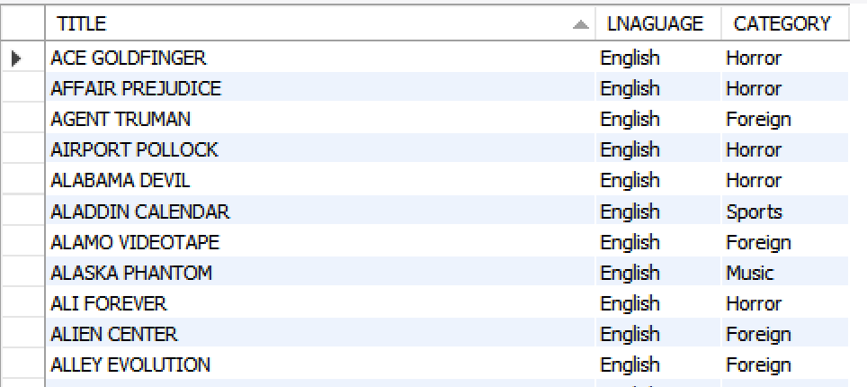

:beginner: _**Functional Programming**_  

:one: _Researching Functional Programming API_  

1. Find a collection from a code base your have experienced.
2. Look at various possibilities of using functional interfaces with generics
3. Try using Consumer, Function and Predicate functional interfaces
4. Create custom functional interfaces and utilize them.


:two: _ComparatorLambda_  

:point_right: Analyze the follwing program and implement the solution  


```java
public class ComparatorLambda {
    
    public static void main(String... args) {

   List<String> list = Arrays.asList("java", "angular","python","perl");     
//1. Create  anonyous class object for Compparator Interface. 
//2. Create  lambda expression for Comparator Interface.      
//3. Sort the list using  anonyous class object and print the sorted values
//4. Sort the list using  lambda expression and print the sorted values
//Tip:  Use Collections.sort method.

// Use below to print the sorted values
        for(String s : list) {
            System.out.println(s);
        }
    }
}


```
:beginner: _**Stream API**_  


:three: _Stream API_
```java
package com.demo.java8;

public class CountryData {
    public static void main(String[] args) {
        String [] countries = new String[] {"Singapore", "India","Japan", "Russia", "Netherlands", "Ukraine","France", "Italy"};
        // Process the stream to find out
//        1. Count of countries with the minimum characters
//        2. Display the countries in the upper case that has minimum characters.
// 3. Calculate the max using reduce() method.
    }
}

```

:beginner: _**JDBC**_  

:four: _User Story_ : 

4.1 As a user I would like to display the movie title, language and category in the below format. 

Hint : Use Joins  

  

:eye: *Explore PreparedStatement*  
4.2  As a user I would like to display the movie title, language and category in the below format by accepting language and category from the user (hard code values) using PreparedStatement.

4.3  As a user I would like to display the movie title, language and category in a tabular format by accepting both the beginning characters of a movie and category or only beginning characters or category from the user (scanner not necessary) and passing them as parameters to the procedure below.

<!-- HINT USE WILDCARD IN SQL (LIKE 'A%') 
USE ? MARK(S) IN THE PROCEDURE CALL FOR JAVA-->
```sql
CREATE PROCEDURE GET_MOVIE_DETAILS2(TITLE_IN CHAR(50), CATEGORY_NAME_IN CHAR(50))
BEGIN
    SELECT FILM.TITLE, LANGUAGE.NAME AS 'LANGUAGE', CATEGORY.NAME AS 'CATEGORY'
    FROM FILM
             JOIN LANGUAGE ON FILM.LANGUAGE_ID = LANGUAGE.language_id
             JOIN FILM_CATEGORY ON FILM.FILM_ID = FILM_CATEGORY.FILM_ID
             JOIN CATEGORY ON CATEGORY.category_id = film_category.category_id
            --  ADD REQUIRED CONDITIONS HERE!
    -- WHERE CATEGORY.name = CATEGORY_NAME_IN;
END;

CALL GET_MOVIE_DETAILS1;
CALL GET_MOVIE_DETAILS2('Comedy');

```
:point_right: Exception Handling

``` java
package com.demo.exception_handling;

public class MultipleExceptionsSingleCatchEx {
    public static void main(String[] args) {
        try {
            String test = null;
            System.out.println(test.length());
            String names[] = {"test me", "for exceptions..."};
            System.out.println(names[1]);
            int result = 0;
            int num1 = 0;
            int num2 = 0;
            result = num1 / num2;
            System.out.println("does not reach here due to Arithmetic Exc....");
        }

        catch(NullPointerException | ArithmeticException | ArrayIndexOutOfBoundsException  exception) {
//IP
            //  Write the logic to test the type of exception and accordingly print a message.
            //  If null pointer : print "Check object for null ....
//  If arithmetic : print "Check numbers to be a non zero value
//            If AIOOBE : print "Check the index to be within the bounds.
// check for RuntimeException (appropriate message), Exception  (appropriate message) and Throwable  (appropriate message)
// Try to solve with one or max two catch blocks.

            System.out.println("Any RuntimeException.........");
            System.out.println(exception);
            System.out.println(exception.getMessage());
        }
//        catch(RuntimeException exception) {
//            System.out.println("specific message  to ArrayIndex......");
//            System.out.println(exception.getMessage());
//        }
//        catch (RuntimeException exception) {
//            System.out.println("All other exceptions!");
//            System.out.println(exception);
//        }
//        catch (Exception exception) {
//            System.out.println("All other exceptions!");
//            System.out.println(exception);
//        }
//        catch (Throwable exception) {
//            System.out.println("All other exceptions!");
//            System.out.println(exception);
//        }
//        anything that is not throwable cannot be thrown and caught....
//        catch (Object exception) {
//            System.out.println("All other exceptions!");
//            System.out.println(exception);
//        }
    }
}

```

:books: **Enhance the below application to  EFFECTIVELY IMPLEMENT NULLPOINTEREXCETPION  / SCORECANNOTBENEGATIVEEXCEPTION(CHECKED) / ALL OTHER EXCPETIONS**  

```java
package com.demo.java8;

import java.util.Arrays;
import java.util.List;
import java.util.function.Consumer;

public class LambdaExceptionHandlingWithWrapperEx {
    public static void main(String[] args) {
//      exceptionHandlingInLambda();
        exceptionHandlingInLambdaWithwrapper();
    }
    private static void exceptionHandlingInLambda() {
        List<Integer> scores = Arrays.asList(150,180,120,140);
        List<Integer> scores2 = Arrays.asList(150,0,120,140);
        // divide 500 by these scores...
//        scores.forEach(score -> System.out.println(500/score));
//        System.out.println("generate exception....");

        scores = Arrays.asList(50,180,0,140);
//        conciseness of the lambdo had gone for a toss.....
        scores.forEach(score -> {
          try {
              System.out.println(500 / score);
          }
          catch (ArithmeticException arithmeticException) {
              System.out.println("Check for zero values : " + arithmeticException.getMessage());
          }
        });
        System.out.println("Reptitive code.....");
        Consumer<Integer> scoreConsumer = score -> {
            try {
                System.out.println(500 / score);
            }
            catch (ArithmeticException arithmeticException) {
                System.out.println("Check for zero values : " + arithmeticException.getMessage());
            }
        };
        scores2.forEach(scoreConsumer);
    }

    private static void exceptionHandlingInLambdaWithwrapper() {
        //ENHANCEMENT LAB : EFFECTIVELY IMPLEMENT NULLPOINTEREXCETPION  / SCORECANNOTBENEGATIVEEXCEPTION(CHECKED) / ALL OTHER EXCPETIONS
        List<Integer> scores = Arrays.asList(150,-50,null,140);
        List<Integer> scores2 = Arrays.asList(150,0,120,140);
        List<Integer> scores3 = Arrays.asList(150,0,120,140);
//        conciseness of the lambdo had gone for a toss.....
        Consumer<Integer> scoreConsumer = score -> System.out.println(500 / score);
        scores.forEach(wrapperForLamdaWithArithmeticException(scoreConsumer));
        System.out.println("**********************************");
        System.out.println("Compact code.....");
        scores2.forEach(wrapperForLamdaWithArithmeticException(scoreConsumer));
        System.out.println("Still Compact code.....");
        scores3.forEach(wrapperForLamdaWithArithmeticException(score -> System.out.println(1000 / score)));
    }

//    The wrapper handles exception in an elegant manner with lambda
//    inputs : score, Consumer<Integer> to Consume the Integer
//    return : a consumer that is capable of handling ArithmeticException
    static Consumer<Integer> wrapperForLamdaWithArithmeticException(Consumer<Integer> scoreConsumer) {
        //wrapping the consumer for excpetion handling capabilities....
        Consumer<Integer> scoreConsumerWithArithmeticExceptionHandlingCapabilites = (score) -> {
            try {
                scoreConsumer.accept(score);
            } catch (ArithmeticException arithmeticException) {
                System.out.println("Check for zero values : " + arithmeticException.getMessage());
            }
        };
        return scoreConsumerWithArithmeticExceptionHandlingCapabilites;
    }


//    var parameterFunctionObject = function() {
//        console.log("functional programming........")
//    };
//    function consumerWrapper(consumerObject) {
//// invoking the function (consumerObject())
//        console.log(consumerObject())
//    };
    // passing a function as a variable/ideitifer (consumerObject)
//    consumerWrapper(parameterFunctionObject);
//
//    passing a function as a parameter to another function
//    consumerWrapper(function() {
//        console.log("functional programming method 2........")
//    });
}
```


:books: **Java 11**  

:one: _String : Implement any 5 new methods of String class in java 11_  
:two: _File Handling : Implement any 2 method of Files class._
:three: _Functional Programming : Implement Predicate.not with String.isBlank_  
:four: _Type Inference : Use local variables in lambda_  
:five: _Collections API : Convert collection to an array using toArray method_  


  
